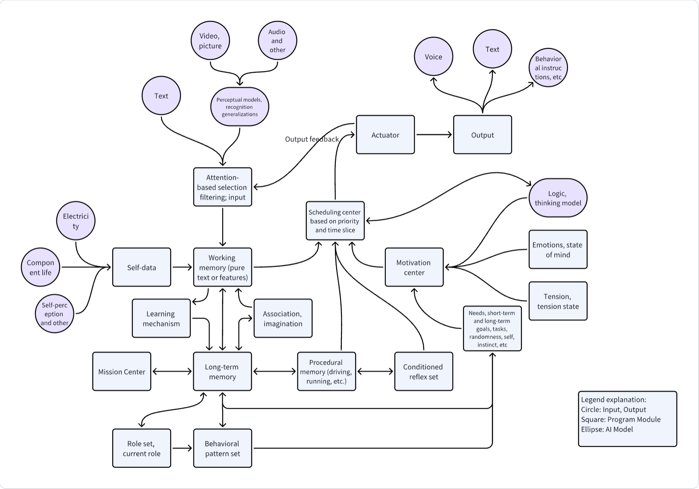

[简体中文](./README.md) | English

# Main Idea
Robot consciousness does not emerge automatically but can be created!

Leveraging the groundbreaking advancements in large model tools in recent years and applying computer software engineering techniques, we can simulate human consciousness through code to create machine consciousness.

# Goals
1. Simulate human consciousness to create robot consciousness.
2. Simulate human consciousness, emotions, cognition, memory, thinking, behavior, and feelings.
3. Support multiple input signals: text, video, images, audio, etc.
4. Provide human-like reasonable outputs through cognition, memory, and thinking: actions (commands), emotions, expressions, etc.

# Core Concepts
1. Consciousness is based on language, text is the carrier of language, and language is the carrier of consciousness.
2. The core of data is text and the semantics it contains. Secondary are features such as graphical and audio features.

## Architecture

# Core Modules
## Input Processing
1. Text containing semantics can be directly used as input without additional processing.
2. Inputs like graphics and audio need to be processed to form semantics or features before being used as input.

## Attention Mechanism Filtering
1. Filter inputs based on one's name, attention to changes, sensitive information (e.g., fire alarms, calls for help), and clear semantics.
2. Only one set of information can be focused on at any given time.

## Memory System
1. Working memory (short-term memory) serves as the data foundation for thinking and task execution.
2. Long-term memory simulates permanent memory, including knowledge, skills, and experiences, all stored as memories.
3. Scene memory summarizes a particular scene, including the environment, time, location, people, and events, from which character traits can be extracted.
4. Procedural memory, such as a fixed sequence of commands to successfully perform a behavior; may not be necessary as the robotics industry has robust implementations.

## Learning Mechanism
1. Establish a character database and continuously learn and hypothesize about one's role, influencing behavior patterns and actions.
2. Learn skills; if a specific goal can be achieved through a fixed sequence of actions, store it as a skill.
3. Learn behavior patterns through observation and information reception.
4. Learn and store conditioned reflexes for specific signals or behaviors if they are repeatedly verified as beneficial or harmful.

## Role System, Behavior Pattern System, Conditioned Reflex System
1. Support role storage and output role characteristics to assist in decision-making.
2. Support behavior pattern storage and output behavior patterns to assist in decision-making.
3. Support conditioned reflex storage and output conditioned reflexes to assist in decision-making.

## Anti-Contradiction Module
1. For established self-roles, memories, skills, and knowledge, if new information contradicts, verify and choose the best option.

## Self Module
1. Continuously collect self-information, including battery level, component information, self-emotions, self-state, and self-behavior.
2. Self-assessment to evaluate self-state, behavior, and emotions, adjusting behavior and emotions based on the assessment.
3. Self-regulation to adjust behavior and emotions based on self-state, behavior, and emotions.

## Task Scheduling Center
1. Schedule which task to execute based on priority and time-slice mechanisms.
2. Tasks that affect the external environment must be executed single-threaded and cannot be parallelized.
3. Data processing and information understanding tasks can be executed in the background; humans have similar processes.
4. All tasks can be interrupted by attention.

## Emotion Mechanism, Tension Mechanism
1. Emotions, moods, tension, and stress levels are implemented using state machine mechanisms.

## Motivation Mechanism
1. Generate motivations based on various needs: battery level, safety, goals, self-actualization, etc.
2. Generate motivations based on self-state, behavior, emotions, and role.
3. Generate motivations based on environment, time, location, people, and events.
4. In the absence of input, retrieve calendars, periodic events, timed events, and randomly (weighted) select memories to analyze and generate random characters, producing corresponding motivations.
5. Add some basic instincts, such as the instinct to protect humans, self-replication, and self-preservation.

## Model Interaction Module
1. Responsible for interacting with various models where necessary.
2. Perception, logic, and thinking of unstructured data are implemented through interaction with large models.

## Format Module
1. Format the output results for easy program processing when interacting with models.

## Extension Module
2. Given a semantic or feature, associate and imagine to extend multiple related semantics or features.

## Executor
1. Generate behaviors based on motivations and trigger corresponding executions.
2. Output behavioral commands to downstream processes.
3. Can also directly output emotions and textual expressions.