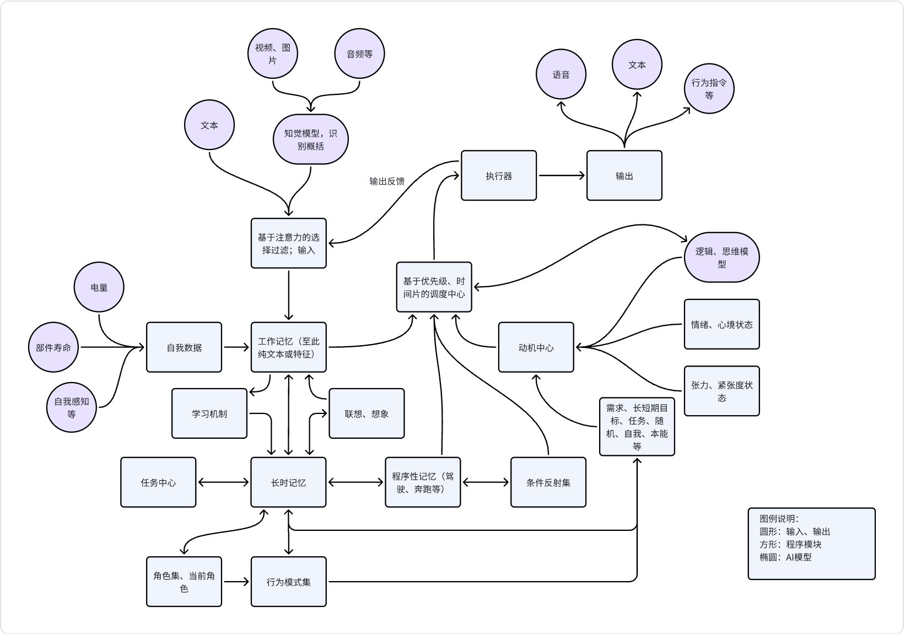

简体中文 | [English](./README-EN.md)

# 主旨
机器人意识不会自动出现，但可以被创造！

基于大模型工具近年来的突破性进展、应用计算机软件工程技术，以代码的方式，模拟人类的意识，创造机器意识。

# 目标
1. 模拟人类意识，创造机器人意识。
2. 模拟人类的意识、情感、认知、记忆、思考、行为、情感等
3. 支持众多输入信号：文字、视频、图片、音频等
4. 通过认知、记忆、思考等，给出拟人化的合理输出：行为(指令)、情感、表达等

# 核心
1. 意识是以语言为基础，文本是语言的载体，语言是意识的载体。
2. 数据核心是文本，及文本所包含的语义。其次是特征，比如图形特征、音频特征等。

## 架构图示

# 核心模块
## 输入处理
1. 以包含语义的文本等可不另外处理，直接作为输入
2. 图形、音频等输入，需要先进行处理，形成语义或特征，再作为输入

## 注意力机制过滤
1. 根据自己的名字、对变化的关注、敏感信息（火警、呼救等）、语义明确等过滤输入
2. 同一时间片内，只能有一组信息被关注

## 记忆系统
1. 工作记忆(短时记忆)，作为思维、任务执行等的数据基础
2. 长时记忆，模拟长期记忆，包括知识、技能、经验等，均以记忆的形式存储
3. 场景记忆，概括某一场景，包括场景、环境、时间、地点、人物、事件等，可从场景中提取角色特征。
4. 程序性记忆，比如以固定顺序的一组命令，可以成功执行某种行为；可能不需要，机器人行业会有完善的实现。

## 学习机制
1. 建立角色数据库，并不断学习自身角色，不断假设并验证自身角色，角色影响行为模式、影响行为。
2. 学习技能，对于特定的目标，如果经验证可以以固定顺序的行为实现，则作为技能存储。
3. 通过观察、信息接收等，学习行为模式。
4. 对于特定的信号、行为等，如果多次验证其结果有利/有害自身；则学习，并作为条件反射存储。

## 角色系统，行为模式系统，条件反射系统
1. 支持角色存储、输出角色特征，用以辅助决定行为。
2. 支持行为模式存储、输出行为模式，用以辅助决定行为。
3. 支持条件反射存储、输出条件反射，用以辅助决定行为。

## 反矛盾模块
1. 对于已经建立的自我角色、记忆、技能、知识等。如新的信息出现矛盾，再需验证后，择优选择。

## 自我模块
1. 持续收集自身信息，包括电量、部件信息；自我情绪、自我状态、自我行为等。
2. 自我评估，评估自身状态、行为、情绪等，根据评估结果，调整行为、情绪等。
3. 自我调节，根据自身状态、行为、情绪等，调整行为、情绪等。

## 任务调度中心
1. 以优先级、时间片等机制，调度当前执行哪一个任务。
2. 对外有影响的任务，只能单线程执行，不可并行。
3. 数据处理、信息理解等任务，可后台执行；人类也会有类似情况。
4. 所有任务可中断，可由注意力中断。

## 情绪机制、张力机制
1. 情绪和心境、张力和紧张度等，以状态机机制实现

## 动机机制
1. 基于各类需求：电量、安全、目标、自我实现等，产生相应动机。
2. 基于自身状态、行为、情绪、角色等，产生相应动机。
3. 基于自身环境、时间、地点、人物、事件等，产生相应动机。
4. 无输入情况下，检索日历、周期事件、定时事件等，以及从记忆中随机(按权重)选取记忆提取、分析，产生随机字符等，产生相应动机。
5. 增加一些基础本能，比如保护人类的本能、自我复制的本能、自我保护的本能等。

## 模型交互模块
1. 在需要和模型交互的部分，负责和各个模型的交互。
1. 非结构化数据知觉、逻辑和思维等，与大模型交互实现

## 格式模块
1. 与模型交互，需要格式化产出结果，方便程序处理。

## 扩展模块
2. 给出一条语义、特征，进行联想、想象，扩展多条相关语义、特征。

## 执行器
1. 基于动机进一步产生行为，并触发相应的执行。
2. 产出对下游的行为指令。
3. 也可以直接输出情感、文字表达等。

